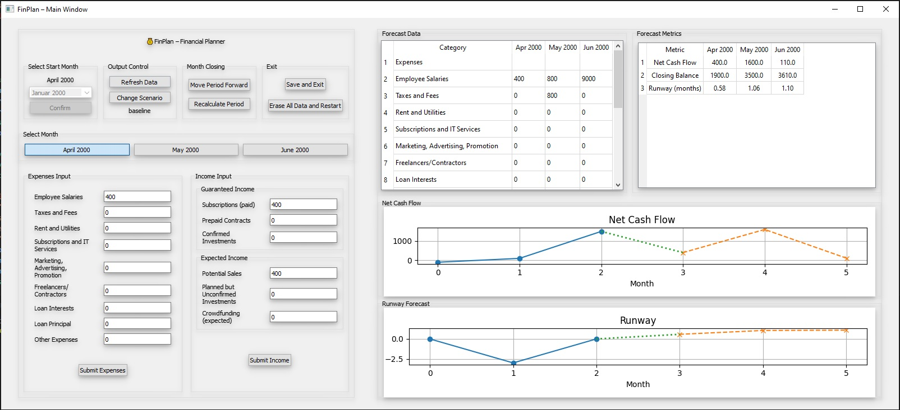

# FinPlan

**Version:** 0.1.0  
**Author:** Eugen Sulakov  

My first Python application where I combined my previous experience as a finance professional with my basic programming skills.  
The idea started as a simple Excel spreadsheet built to help a startup with short-term financial planning.  
Over time, it evolved into a desktop GUI tool that allows you to:

- Enter and categorize financial transactions (income, expenses, transfers)  
- Build and compare financial scenarios (“what-if” planning)  
- Shift periods forward to simulate cash-flow timing  
- View monthly data in tables and visual charts  
- Generate interactive charts using Matplotlib  
- Save and load your workbook as JSON (for sharing or backup)  
- Customize categories and constants to match your business logic  

---

This is the first version of the application. The code still requires refactoring and more testing.




## Prerequisites

- Python 3.7 or higher  
- Windows, macOS or Linux  

---


## Project Structure

```
PROJECT_ROOT/
│
├── data/                  ← default JSON data storage
│   └── data.json
│
├── FinPlan/               ← main application package
│   ├── __init__.py
│   ├── __main__.py        ← application entry point
│   ├── controller/        ← business logic controllers
│   ├── model/             ← data models, scenarios, constants
│   ├── resources/         ← stylesheets, assets
│   └── view/              ← PyQt5 UI components
│
├── .gitignore
├── LICENSE
├── README.md
├── requirements.txt
└── setup.py
```

---

## License

This project is licensed under the MIT License. See [LICENSE](LICENSE) for details.


[def]: screenshot.png